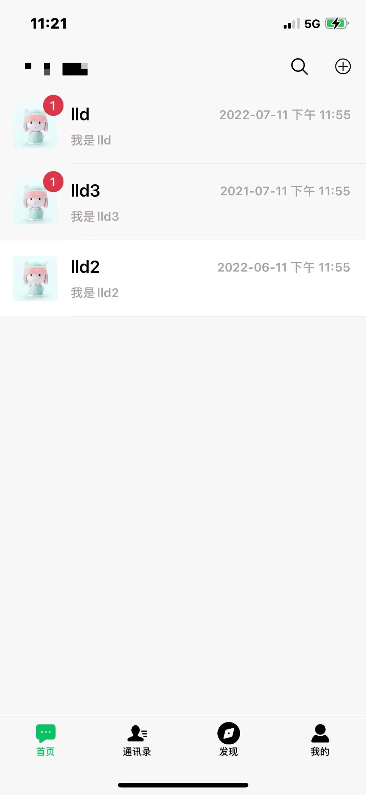
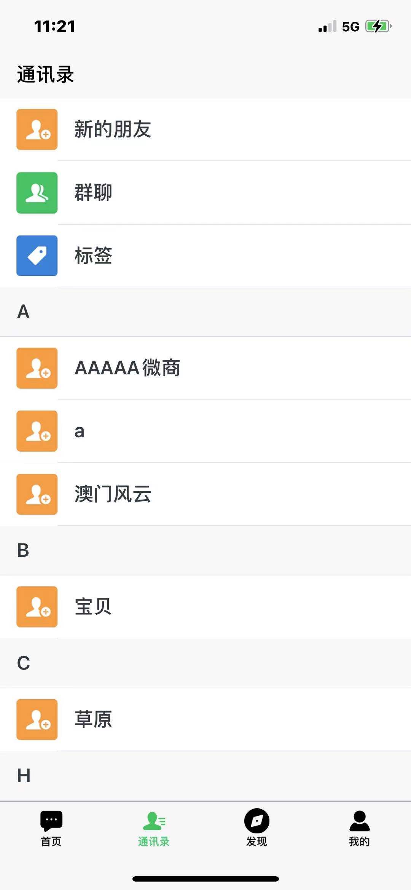
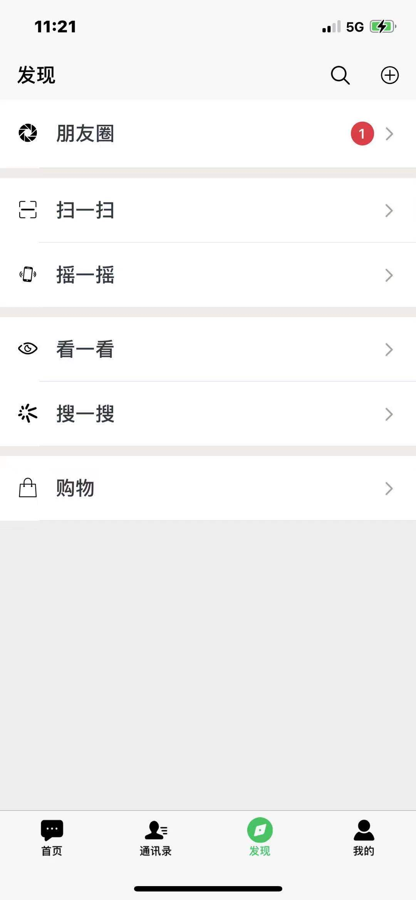
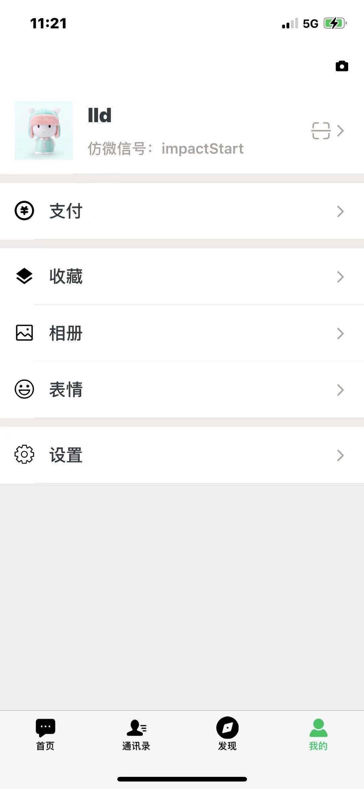

# l-im解决方案

#### 介绍
l-im 是 lld 基于 netty 的即时通讯服务。由lld维护和支持。

# 功能和特性
- 私有化协议，可自行修改协议规则节省流量和数据包大小。
- 全平台客户端，四端同时在线（移动端，pc端，web端和小程序端），数据和状态多端完美同步。
- API功能全面，适用多场景需求。
- 拥有机器人和频道功能。

# TODO List
- [ ] 项目重构，会剥离出im-tcp和im-server
- [ ] 项目定位，明确项目定位，具体是作为im通用组件，还是作为私有的app通信项目
- [ ]   ....

[进度](im-schedule.md ':include')

配套app正内部开发中：

#### 编译
在安装JDK1.8以上及maven的前提下，在命令行中执行mvn clean package

